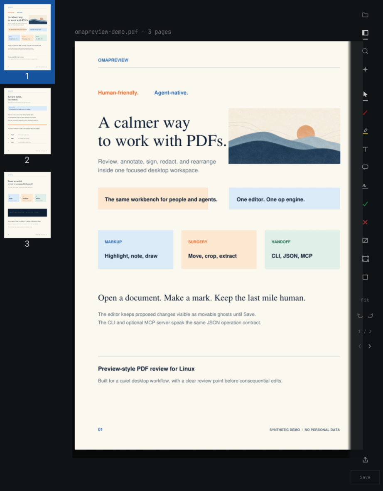
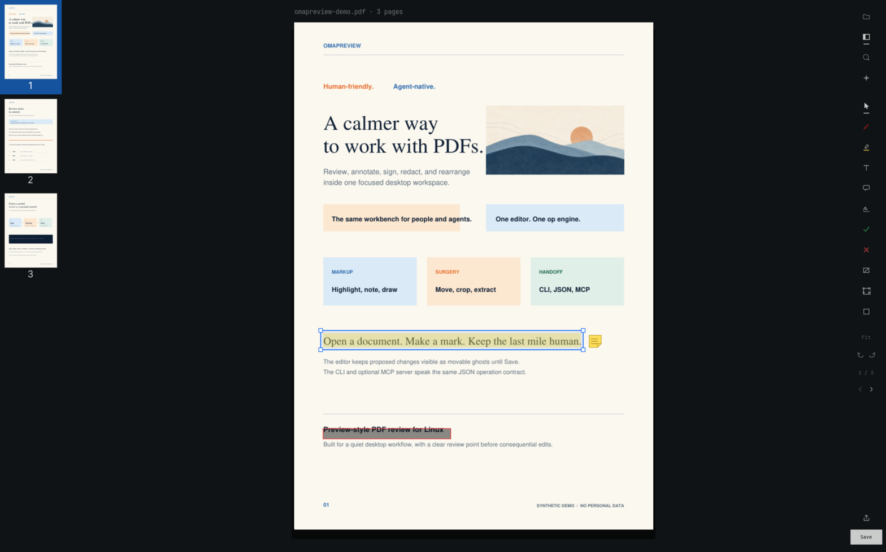

<p align="center">
  
</p>

# omapreview

**Human-friendly, agent-native PDF review for Linux.**

omapreview is a focused GTK4 workspace for reading, annotating, signing,
redacting, and rearranging PDFs. It is built for Omarchy and works on plain
GTK Linux too.

<p align="center">
  
</p>

<p align="center">
  
</p>

<p align="center"><sub>Real GTK4 editor pixels. The document is a reproducible synthetic fixture; no personal PDFs are used.</sub></p>

## One workbench, two ways to work

| For people | For agents |
| --- | --- |
| Open a PDF, mark it up, nudge proposed changes, and Save when the page looks right. | Read structured text and bboxes, build JSON ops, and run the same engine through the CLI or optional MCP server. |

The editor keeps proposed changes visible as movable ghosts until Save. The
CLI and MCP server use the same JSON operation contract, so a human can review
what an agent proposes before it is written.

## Read, mark, hand off

<p align="center">
  
</p>

### Review

Open an empty editor from the Omarchy launcher, or open a file directly. Use
the page rail and thumbnails to move through the document. Search is available
with Ctrl+F.

### Annotate

Highlight, underline, strike out, add notes, draw with ink, add shapes, place
saved signatures, fill form fields, crop, redact, and manage pages. Redaction
removes the matched content; a black drawing is not a redact.

### Automate

`omapreview read` returns text, layout, annotations, fields, and bboxes.
Coordinates are PDF points with a top-left origin and pages are 1-based. Use a
bbox from `read` as a precise target for an operation.

## Install

### Arch / Omarchy

The visitor installer fetches the v0.1.0 release, installs its Arch
dependencies, and adds the command and desktop entry for your user:

```bash
curl -fsSL https://github.com/Skeptomenos/omapreview/releases/download/v0.1.0/install.sh | bash
```

Then open **omapreview** from the launcher with Super+Space. The editor starts
empty. Open a PDF with the in-app **Open PDF** button or Ctrl+O.

### From a checkout

```bash
git clone https://github.com/Skeptomenos/omapreview.git
cd omapreview
bash packaging/install-user.sh
```

For a development install, keep system GTK bindings visible:

```bash
python -m venv --system-site-packages .venv
.venv/bin/pip install -e '.[dev]'
.venv/bin/omapreview edit
```

## Editor shortcuts

| Shortcut | Action |
| --- | --- |
| Ctrl+O | Open a PDF |
| Ctrl+S | Save pending ghosts through the engine |
| Ctrl+Z / Ctrl+Shift+Z | Undo / redo, including saves |
| Ctrl+F | Search |
| F9 | Toggle thumbnails |
| R | Redact tool |
| Space / Enter (signature pad) | Arm and save a trackpad signature |

## CLI

```bash
omapreview edit document.pdf
omapreview edit document.pdf --ops proposal.json
omapreview read document.pdf --json
omapreview annotate document.pdf --page 1 --match "renewal date" -o marked.pdf
omapreview redact document.pdf --page 1 --match "PRIVATE TOKEN" -o redacted.pdf
omapreview pages document.pdf --list
```

For a batch of mixed edits, put the operation list in JSON:

```json
[
  {"op": "highlight", "page": 1, "match": "renewal date"},
  {"op": "note", "page": 1, "at": [420, 180], "text": "Check this before signing."}
]
```

```bash
omapreview apply document.pdf --ops edits.json -o reviewed.pdf
```

Use `--dry-run --json` when you want resolved geometry without writing an
output. See the [operations spec](docs/ops.md) for the complete contract.

## MCP

Install the optional MCP extra, then start the server:

```bash
.venv/bin/pip install -e '.[mcp]'
.venv/bin/omapreview-mcp
```

The server provides broad coverage for document reads, page operations,
markup, forms, signing, and redaction through the operations contract. Safety
defaults depend on the entry point: dedicated MCP redaction and signature
calls accept explicit confirmation, while generic `apply_ops` and CLI writes
follow their own documented defaults. Use `--dry-run` or the MCP confirmation
argument when you want a proposal first.

See the [agent playbook](skill/SKILL.md) for PDF task workflows.

## Project notes

- User-facing command: `omapreview`. Python package: `omepreview`.
- Desktop entry: `omapreview edit %f`; it does not open a launcher file picker.
- Saved trackpad signatures go to `~/Downloads/omapreview/signature/`.
- The editor, CLI, and MCP share the core PyMuPDF operation engine for supported operations.
- The project is licensed under [AGPL-3.0-or-later](LICENSE).

The screenshot fixture and asset provenance are recorded in
[`docs/evidence/readme-redesign-2026-09-16.md`](docs/evidence/readme-redesign-2026-09-16.md).
