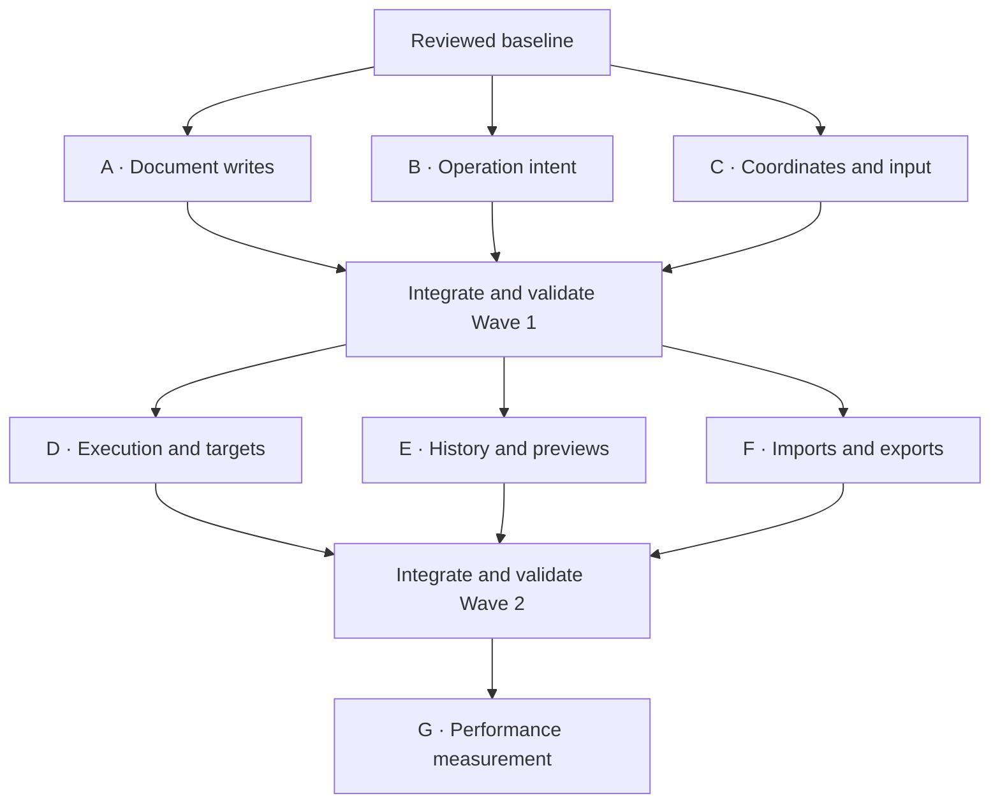

# Fix the confirmed review defects in coordinated batches

Goal: users can edit, preview, save, undo, and export PDFs without losing content or changing the intended targets.

Acceptance: the 24 confirmed findings in the [recheck](../evidence/review-recheck-2026-09-15.md) have regression coverage and no longer reproduce. The required repository suite exits 0 on the integrated branch. Changed GUI journeys pass native GTK acceptance. R23 produces measured evidence for a later performance decision; R26 stays closed.

Scope: six implementation tasks in separate worktrees, grouped into two parallel waves, followed by one measurement task. Keep the current product architecture and coordinate contract. Use generated PDFs and signatures. Publication, installation, and release are separate from this plan.

Context: product code at `784d158`; recheck record committed in `ae37d68`. The bound Linear project query returned no issues across all assignees and states on 2026-09-15. R-numbers are review findings, not Linear issue IDs.

## Batch map

| Batch | Outcome | Findings | Start condition |
|---|---|---|---|
| A | Safe document writes | R02, R03, R08, R18 | Wave 1 |
| B | Preserve and validate operation intent | R06, R07, R19, R21 | Wave 1 |
| C | Correct editor coordinates and input | R01, R10, R11, R12 | Wave 1 |
| D | Correct batch execution and object targets | R04, R13, R14, R16, R17 | Wave 2, after Wave 1 integration |
| E | Stable editor history and preview inputs | R05, R09, R15, R24, R25 | Wave 2, after Wave 1 integration |
| F | Safe signature imports and exports | R20, R22 | Wave 2, after Wave 1 integration |
| G | Measure responsiveness and memory | R23 | After the integrated correctness fixes |

R26 is already fixed and has no implementation batch. Every other finding has one owner.

## Next increments

- [ ] Wave 1: A, B, and C run concurrently with the ownership boundaries below.
- [ ] Integrate Wave 1 one branch at a time; use the integrated result as the common base for Wave 2.
- [ ] Wave 2: D, E, and F run concurrently. Resolve any cross-batch interface change before overlapping edits start.
- [ ] Integrate Wave 2 and verify mixed journeys across the fixes.
- [ ] Run G and scope performance work from its measurements.

### A — Safe document writes

**One result:** a rejected edit leaves existing files intact; successful ordinary saves preserve encryption settings.

Own `engine.py` publication/output planning (`apply`, `_save`, extraction publication), `fs_privacy.py`, and the GUI save/restore publication path (`save_pending`, `_restore_file`, history-stack changes needed to keep restore failures consistent). Preserve the existing operation schema and ghost coordinate representation.

- Stage the entire GUI save and publish once. Failure must preserve source bytes, existing output bytes, pending edits, and usable history. Retrying must apply each edit once.
- Extract-only must leave its source byte-identical. Reject source aliases, duplicate targets, and extraction/main-output collisions before writes. Stage extractions until the batch has succeeded. State the supported multi-output failure guarantee; do not claim that several file replacements are one atomic operation.
- Restore undo/redo bytes through a safe replacement path. A failed restore must retain the current file and usable history stacks.
- Preserve owner-password encryption and permission settings for ordinary edits, or reject unsupported preservation before replacing the source.

Checks: real-Editor partial-save reproduction; injected save/restore failures; all four extraction cases; same-file aliases; encrypted save/reopen. A establishes the publication behavior that D, E, and F build on.

### B — Preserve and validate operation intent

**One result:** validated requests and GUI proposals retain their meaning, and consequential defaults agree across MCP entry points.

Own `ops.py`, GUI `_load_proposals`/`to_ops`, `redact_io.py` proposal conversion, MCP confirmation wrappers, and numeric validation at `render.snapshot`/`_draw_grid` and relevant CLI boundaries. Do not change the engine dispatcher or GUI save/history code.

- Preserve `apply_now`, fill, style, and geometry for supported proposals. Reject the complete proposal with an actionable error if a variant or ordering cannot be represented faithfully. Do not silently omit operations or build new visual tools just to cover an unsupported variant.
- Keep existing ghost coordinate keys and unrotated PDF coordinates compatible with C. Additional intent metadata may be retained without redesigning the shared item model.
- Reject non-boolean consequential flags. Validate finite values, positive grid steps and scales, and appropriate numeric ranges. Put explicit, documented limits around grid/pixel allocation.
- Make generic and dedicated MCP defaults agree for consequential operations. Keep explicit confirmation possible. No new authentication system or cryptographic approval mechanism is required by these findings.

Checks: proposal round trips and actual Save with `apply_now: false`; invalid-string flags; bounded bad-grid/scale inputs; generic/dedicated tool calls with omitted, denied, and granted confirmation. Full protocol acceptance must use the supported optional MCP environment.

### C — Correct editor coordinates and input

**One result:** the visible target is the saved target, and ordinary clipboard, keyboard, and drag actions work.

Own GUI pointer/display transforms, overlays and hit testing, `move_item`, drag/key callbacks, relevant `view_gestures.py`/`crop_coords.py` logic, and native clipboard transport in `page_clipboard.py`. Leave proposal conversion, save/history, and page serialization algorithms to their other owners.

- Keep pending operations in unrotated PDF points. Apply forward/inverse rotation and crop transforms consistently for input, overlays, drag deltas, search marks, and hit targets. The existing raster rotation fix must remain intact.
- Read clipboard MIME data with the correct GTK API. Avoid a blocking nested main loop; provide bounded/cancellable completion and a usable error path.
- Route sidebar shortcuts without swallowing unrelated undo/redo/navigation.
- Give field-fill and annotation-deletion ghosts explicit drag behavior; moving the associated widget/annotation is not implicitly a new capability.

Checks: 0/90/180/270° with nonzero CropBox; intended word removal and neighboring text retention after reopen; signature placement; two-window paste; shortcuts with sidebar open/closed and text-entry focus; both formerly crashing drags. Run native GTK acceptance in addition to model checks.

### D — Correct batch execution and object targets

**One result:** preview and commit execute the same edit sequence against the intended pages, annotations, and widgets, while copied page groups retain internal links.

Own engine ordering, simulation and verification; precise form selectors in `ops.py`, `read.py`, CLI/MCP wrappers and GUI field conversion; page-copy algorithms in engine/clipboard. Preserve A's publication guarantees and B's input/confirmation rules. Coordinate any page-identity helper change with E before editing it.

- Keep annotation deletion groups from crossing structural operations. Resolve the existing high-to-low index contract explicitly; do not replace it silently with a different indexing rule.
- Simulate all state changes on disposable documents for dry run, while publishing no files.
- Keep redaction verification tied to the edited logical page and geometry after later page operations.
- Address the intended widget when names repeat. If an input remains ambiguous, reject it rather than selecting the first match.
- Preserve internal links when both endpoints are imported, extracted, or copied. State behavior for links to pages outside the selected set.

Checks: content/object identity assertions for mixed batches, dry-run/commit agreement, post-move/crop verification, same-name widgets, cross-page links, and continued transaction safety.

### E — Stable editor history and preview inputs

**One result:** pending edits, immutable insertion inputs, and undo history stay associated with the document version the user reviewed.

Own `page_preview.py`, GUI history/checkpoint/reload/rebinding behavior, and the lifecycle connection to A's save boundary. Keep D's engine ordering and form-selector work separate. D owns engine execution identities; E owns editor version/history identities. Any shared representation change must be agreed before implementation.

- Detect external modification while local edits exist. Preserve the local session and surface a conflict rather than silently retargeting or discarding work. Never overwrite an externally modified file from stale history without resolving that conflict.
- Retain the bytes and page-identity baseline needed for undo/redo after Save, including pasted source PDFs.
- Snapshot external PDF/image insertion inputs when they become pending so later source-file changes cannot alter Save.
- Clean rejected scratch rebuilds, while keeping the previous valid preview usable.
- Derive inserted badges from page identity, including blank and identical-text pages.

Checks: save/undo/redo after paste, delete, and move; external reorder/replace with dirty state; changed or removed insertion source; failure cleanup; badges across move/delete/undo. This batch includes the two low-priority preview defects because it already owns their lifecycle and identity code.

### F — Safe signature imports and exports

**One result:** importing an invalid signature or exporting a document cannot destroy an existing asset or weaken output-file privacy.

Own signature validation/replacement, GUI ZIP export, and snapshot output creation. Follow A's established file-publication pattern and retain B's rendering validation. Do not change engine save semantics or the GUI history model.

- Decode a candidate signature before replacement. Preserve the working signature through validation/copy/replace failures; handle same-path imports and format replacement deliberately.
- Create PNG/ZIP outputs privately. Use collision-safe ZIP names or explicit replacement behavior; preserve unrelated existing archives. Apply the same alias/collision review to snapshot outputs.
- Isolate the existing signature-store tests from the user's `XDG_CONFIG_HOME`; this is fixture repair, distinct from R22.

Checks: malformed/truncated SVG/PNG, same-path import, injected publication failures, mode checks, existing export targets, and successful valid replacement. Use synthetic assets only.

### G — Measure responsiveness and memory

**One result:** measurements identify the next performance bottleneck and a bounded improvement target.

Measure thumbnail opening/refresh, repeated page operations, search, history memory, and signature-recorder responsiveness using representative generated text/scanned PDFs. Separate wall time, memory, and input responsiveness. Record document sizes and environment. Propose budgets and a next work item from the results; do not start a general worker/cache rewrite as part of measurement.

## Parallel ownership and integration

Worktrees isolate edits on disk; they do not remove source or behavior conflicts. Parallel execution here is conditional on these boundaries:

| Wave | Shared file | Ownership |
|---|---|---|
| 1 | `gui.py` | A: save/restore publication; B: proposal load/convert; C: coordinates, overlays and input callbacks |
| 1 | `docs/ops.md` | A: output and preservation guarantees; B: input validation and confirmation; C: coordinate clarification only |
| 2 | `gui.py` | D: form target conversion; E: history/reload/preview lifecycle; F: ZIP export |
| 2 | `engine.py` | D owns execution changes; E/F consume the integrated publication path without editing it |
| 2 | `page_preview.py` | E owns it; D must coordinate before reusing or changing its identity helpers |
| 2 | `fs_privacy.py` | F may extend output helpers; E must coordinate if preview cleanup also needs a helper change |

- No whole-file formatting, broad GUI extraction, dependency upgrade, or unrelated cleanup within a batch.
- Keep the public coordinate convention and existing ghost geometry keys stable through Wave 1. If a fix requires changing a shared contract, serialize the affected work instead of allowing independent guesses.
- Use separate focused regression files where concurrent tasks would otherwise edit the same existing test file. Update shared test fixtures through one owner.
- Native GUI/clipboard acceptance runs one task at a time on this host to avoid focus and clipboard interference. Model tests can run concurrently with isolated scratch/config paths.
- The orchestrator owns this plan and `index.md`. Workers return scope, commits, test evidence, native acceptance evidence, and limits. One task per batch; A and D are the largest and should land as cohesive internal commits, without splitting their shared ownership across simultaneous workers.
- Integrate Wave 1 in A → B → C order, then validate the combined state. Integrate Wave 2 in D → E → F order. This is a review sequence, not permission for workers to merge each other or publish releases.
- Wave 2 starts from the integrated Wave 1 commit, not from six independently diverged copies of the original review baseline.

The common Wave 1 gate is deliberately conservative. D depends on A's transactions, B's schema, and C's clipboard transport. E depends on A's save/history transition and compatibility with B/C's ghosts. F depends on A's output policy and B's render validation. D/E/F otherwise have separate responsibilities within their stated function boundaries.

## Verification and completion

Each batch must replace its diagnostic observations with meaningful regression assertions and run the relevant tests. Run `.venv/bin/python -m pytest tests/ -q` before handback and report the exact result. The baseline has a clipboard failure assigned to C and a signature-test isolation failure assigned to F; report either explicitly if it remains before its owner lands. The integrated completion gate requires zero failures, not a permanent baseline waiver.

After each wave, verify interactions between batches, especially proposal → rotated target → Save, mixed page/markup failure → retry, external change → conflict → history, and paste → Save → undo → redo. Re-run impacted checks after integration changes; routine docs edits need only document and diff checks.

## Progress (LIVING)

Reconciled: 2026-09-15.

- All 24 confirmed defects have exactly one batch owner. R23 is measurement-only; R26 is closed.
- Planning complete. Implementation tasks and Linear batch issues have not been created.
- Next execution increment: dispatch A/B/C from one agreed source commit with the function ownership above. Wave 2 waits for the integrated result.

## Decision Log (LIVING)

- 2026-09-15: Group by shared behavior and change boundaries, not by severity alone. File publication, operation intent, and native input form three parallel Wave 1 tasks. Engine correctness, editor lifecycle, and asset handling form Wave 2.
- 2026-09-15: Keep R24/R25 with editor lifecycle work because the same identity/cleanup changes address them. Keep performance implementation out until R23 has measurements.
- 2026-09-15: Require one integrated baseline between waves. Function-level ownership permits bounded parallelism in `gui.py`; shared contract changes trigger sequencing instead.
